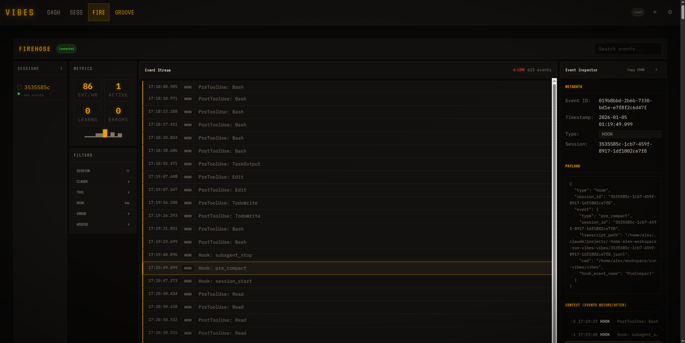

# vibes

[](https://github.com/run-vibes/vibes/actions/workflows/ci.yml)
[](docs/board/README.md)
[](LICENSE)

The vibe engineering mech suit.

**vibes** augments *you*—the human developer—with AI-powered superpowers: remote session control, persistent context, and a learning system that remembers what works. You stay in command; vibes amplifies your reach.



## Getting Started

- [Features](#features) — What vibes does
- [Quick Start](#quick-start) — Install and run
- [Usage](#usage) — CLI commands and examples
- [Documentation](#documentation) — Architecture, plugins, and roadmap
- [Glossary](docs/GLOSSARY.md) — Key terms explained

## Features

- **Remote Access** — Control Claude Code sessions from your phone, tablet, or any device via web UI
- **Session Mirroring** — Real-time sync between your terminal and remote devices
- **Plugin System** — Extend vibes with native Rust plugins for custom commands and workflows
- **Continual Learning** — groove learns your patterns and preferences across sessions
- **Cross-Platform** — Single binary for Linux, macOS, and Windows

### Coming Soon

- **Model Management** — Unified API for cloud (Anthropic, OpenAI) and local models (Ollama, llama.cpp)
- **Agent Orchestration** — Multi-agent sessions with swarms for parallel and pipelined workflows
- **Evaluation Framework** — Benchmark against SWE-Bench, track longitudinal performance
- **Observability** — OpenTelemetry tracing, metrics, cost tracking, and alerts
- **TUI** — Interactive terminal interface for agent control, embeddable in web

## Quick Start

```bash
# Clone with submodules
git clone --recursive https://github.com/run-vibes/vibes
cd vibes

# Enter dev environment (requires Nix)
direnv allow

# Build (release)
just build-release

# Run
./target/release/vibes claude

# Or for development (debug build)
just build
cargo run -p vibes-cli -- claude
```

Persistent event storage is automatic—no additional setup required.

### Linux: io_uring Requirement

On Linux, the event storage system (Iggy) uses io_uring for high-performance async I/O. This requires sufficient locked memory:

```bash
# Check current limit
ulimit -l

# If less than 64 MB, increase it:
ulimit -l unlimited
```

For persistent configuration, add to `/etc/security/limits.conf`:
```
* soft memlock unlimited
* hard memlock unlimited
```

If the limit is insufficient, vibes will display a helpful error message and refuse to start until the system is configured correctly.

## Usage

```bash
# Use like claude, but with superpowers
vibes claude "refactor the auth module"

# All claude flags work
vibes claude -c                          # Continue last session
vibes claude --model claude-opus-4-5     # Model override
vibes claude --system-prompt "Be terse"  # Custom system prompt

# Vibes additions
vibes claude --session-name "auth-work"  # Human-friendly session names
vibes claude --no-serve                  # Disable background server

# Configuration
vibes config show                        # Display merged configuration
vibes config path                        # Show config file locations

# Access from any device on your network
# Web UI available at http://localhost:7432
```

## Testing

```bash
# Unit + integration tests (recommended for development)
just test

# All tests including those requiring Claude CLI
just test-all

# E2E browser tests (requires Playwright installed)
just test-e2e

# Pre-commit checks (fmt, clippy, test)
just pre-commit
```

## Documentation

- [Architecture](docs/ARCHITECTURE.md) — System design, event flow, and component overview
- [Plugins](docs/PLUGINS.md) — Plugin system and in-tree plugins (including groove)
- [Roadmap](docs/ROADMAP.md) — Development phases and milestone tracking
- [Product Requirements](docs/PRD.md) — Full design specifications
- [Planning Board](docs/board/README.md) — Kanban board tracking implementation status
- [Planning Conventions](docs/board/CONVENTIONS.md) — How to create design and implementation plans
- [CLAUDE.md](CLAUDE.md) — Development guidance for contributors
- [Glossary](docs/GLOSSARY.md) — Key terms explained

## License

MIT License — see [LICENSE](LICENSE) for details.
